<div align="center">

# AStock Arena

### Multi-Agent LLM Trading System for China A-Share Market

[](https://python.org)
[](LICENSE)
[](https://github.com/psf/black)
[](documentation/CONTRIBUTING.md)

[🌟 Overview](#-overview) • [✨ Key Features](#-key-features) • [🏗️ System Architecture](#-system-architecture) • [🚀 Quick Start](#-quick-start) • [📖 Documentation](#-documentation) • [🧪 Experiments & Results](#-experiments--results) • [🤝 Contributing](#-contributing)

---

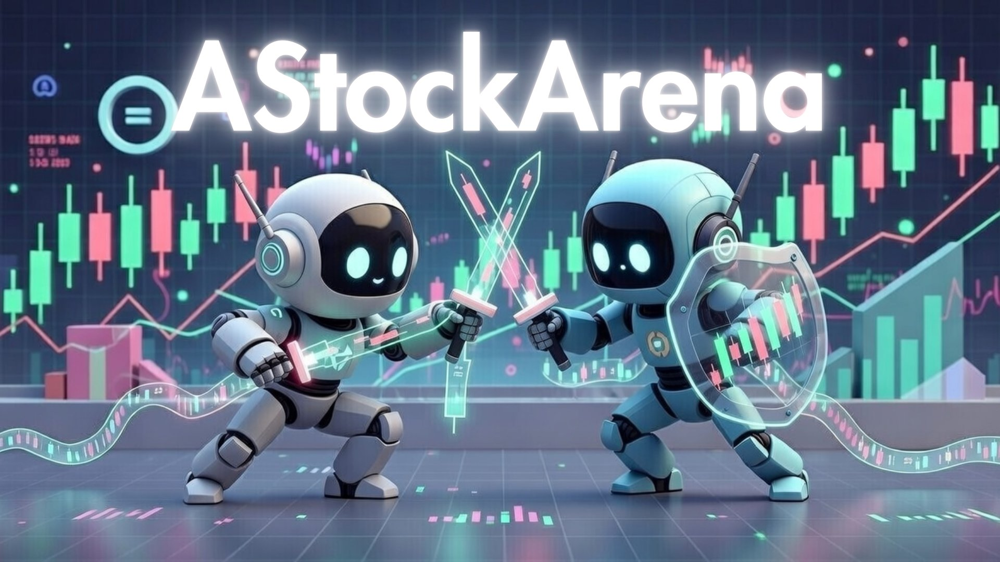
*AStock Arena: A multi-agent trading framework with shared market snapshots and real-time visualization*

</div>

---

## 📊 Performance Comparison Results

**Updated: January 21, 2026**

This section showcases comprehensive performance comparisons across Lite and Pro model versions, including benchmark analyses and portfolio dynamics during the trading period (January 12-21, 2026).

### Dual Model Version Strategy

AStock Arena supports two configurable model portfolios to optimize for different use cases:

#### 🟢 **Lite Version** - Cost-Optimized Models

The Lite version emphasizes cost-effectiveness while maintaining solid decision-making quality. It's ideal for frequent backtesting, parameter tuning, and large-scale experiments. All 5 Lite models run in parallel with identical market data, allowing fair performance comparison at lower API costs.

**Models**: 
- Claude Haiku 4.5
- DeepSeek Chat
- GPT-5.1
- Qwen3-235b
- Gemini 2.5 Flash

##### Lite Version - Unrealized PnL (Market Price)
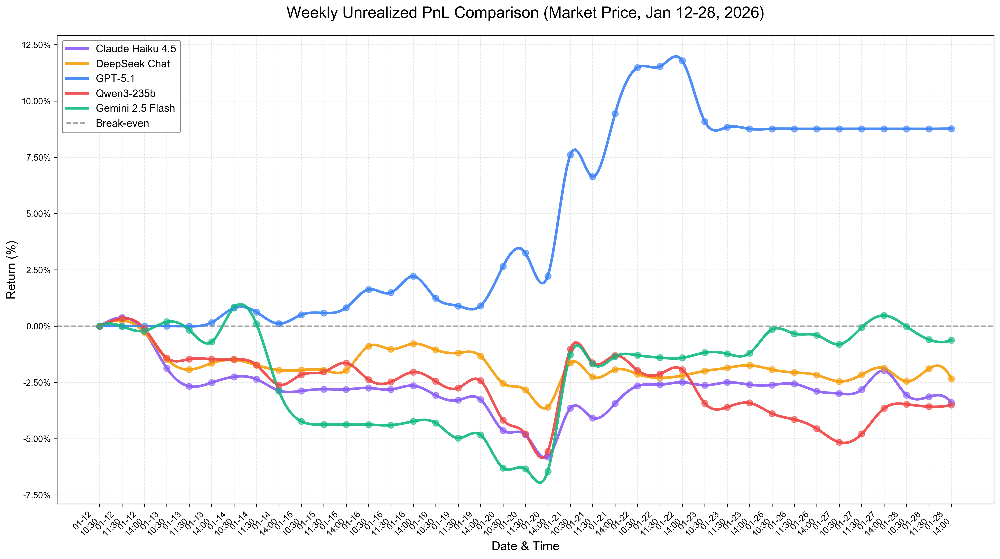
*Unrealized returns using market prices at decision time. Shows real-time performance as if positions were liquidated at current market rates. Trading period with 3 decision points daily (10:30, 11:30, 14:00 Beijing time).*

##### Lite Version - Realized PnL (Cost Price)
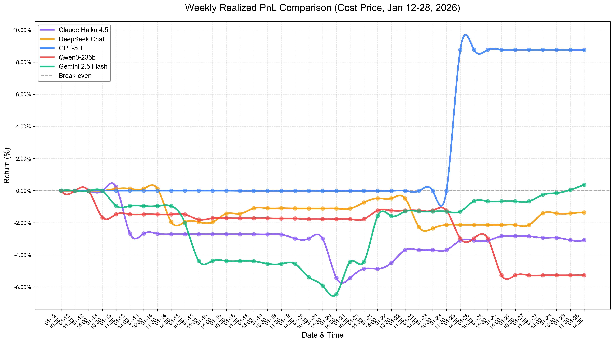
*Realized returns using cost basis. Shows the value of closed positions and the cost of open positions. Represents the actual profit/loss from executed trades without mark-to-market volatility.*

---

#### 🔵 **Pro Version** - Advanced Models

The Pro version leverages cutting-edge reasoning and planning capabilities. It's recommended for production trading and serious research requiring maximum decision quality. These advanced models demonstrate superior strategic planning in complex market scenarios.

**Models**:
- Claude Opus 4.5
- DeepSeek Reasoner
- GPT-5.2
- Qwen3-Max
- Gemini 3 Pro Preview

##### Pro Version - Unrealized PnL (Market Price)
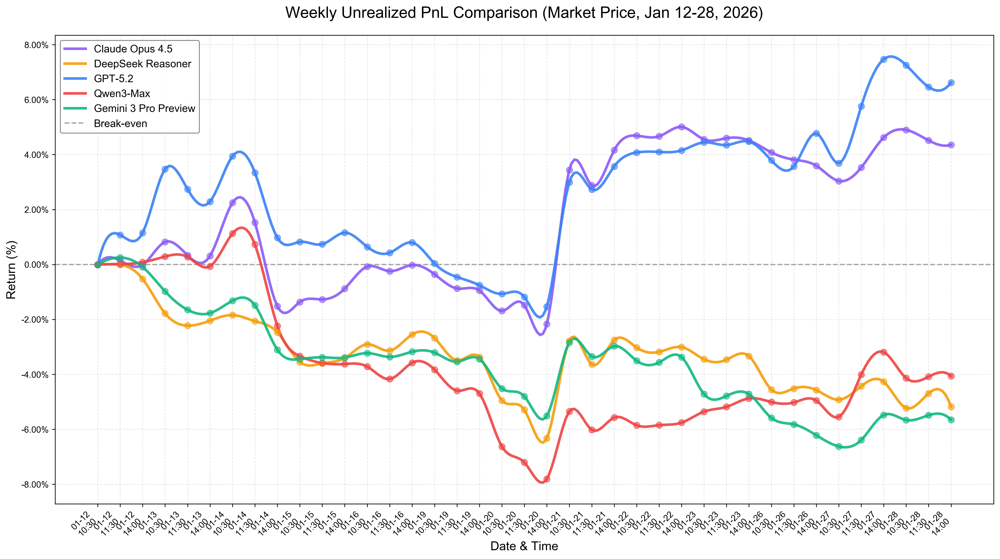
*Unrealized returns for Pro models using market prices. Advanced reasoning models typically show more consistent performance with better risk management and market timing.*

##### Pro Version - Realized PnL (Cost Price)
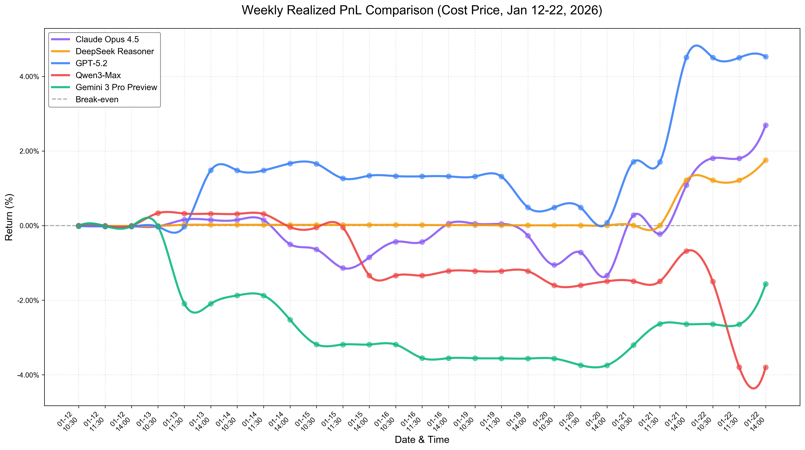
*Realized returns for Pro models using cost basis. Demonstrates the effectiveness of advanced models in actual trade execution and position management.*

---

#### 📈 **Model Version Performance Uplift**

The chart below directly compares each Lite model against its corresponding Pro upgrade, highlighting the performance improvement from using more capable LLMs:

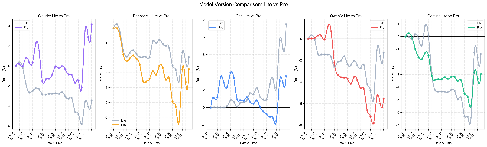
*5-subplot comparison (Lite vs Pro): Claude Haiku→Opus, DeepSeek Chat→Reasoner, GPT-5.1→5.2, Qwen3-235b→Max, Gemini 2.5→3-Pro. Gray represents Lite performance, colored lines represent Pro performance for each model family.*

---

### Benchmark Comparisons

#### 📊 AI Models vs Market Benchmarks (All Models)

The system compares AI-driven trading performance against established market benchmarks using unrealized (mark-to-market) pricing for fair comparison:

#### 📊 Lite vs Pro Benchmarks Comparison

Side-by-side comparison of Lite and Pro model versions against market benchmarks. This dual-panel visualization clearly shows performance differences between cost-optimized and advanced models:

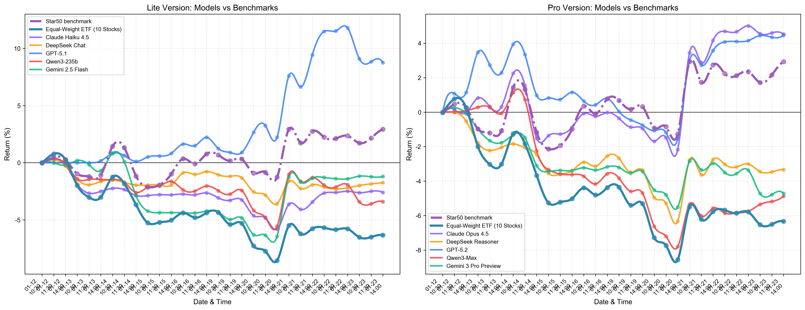
*Left panel: 5 Lite models (Haiku, Chat, GPT-5.1, Qwen3-235b, Gemini 2.5 Flash) vs ETF and 科创50. Right panel: 5 Pro models (Opus, Reasoner, GPT-5.2, Qwen3-Max, Gemini 3-Pro) vs same benchmarks. Direct visual comparison of model version upgrade effects on benchmark performance.*

This chart enables easy assessment of:
- Whether Lite models can compete with passive benchmarks
- Whether Pro models demonstrate significant improvement over benchmarks
- The performance gap between Lite and Pro versions relative to market indices

#### 🎯 Stock Selection Analysis

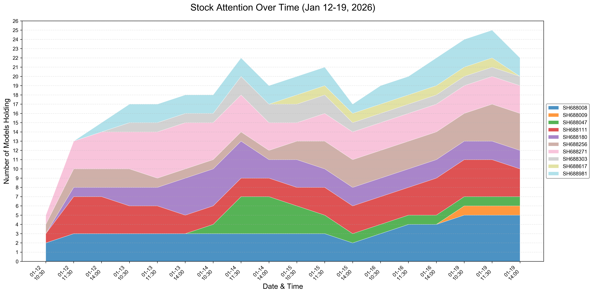
*Stock selection patterns: Shows which stocks were most frequently held across all models during the trading period. Darker colors indicate higher model consensus and more frequent selection, revealing market preferences and perceived value opportunities.*

#### 📅 Daily Portfolio Dynamics

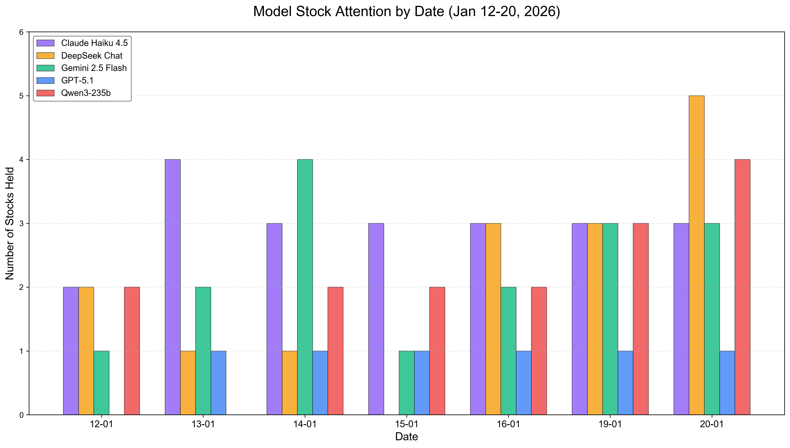
*Temporal allocation patterns: How model allocations evolved day-by-day during the trading period. Each color represents a stock, showing portfolio composition changes in response to market conditions and decision-making processes. Wider bands indicate more concentrated positions.*

---

#### 💾 ETF Performance Baseline

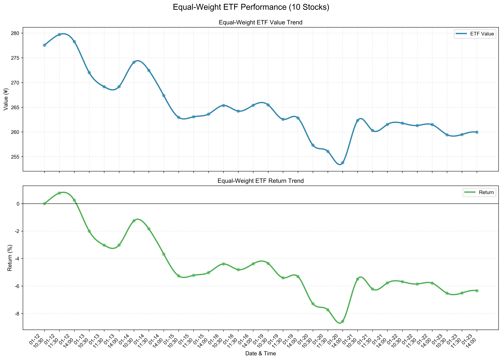
*Equal-weight ETF returns over the trading period. Provides a buy-and-hold baseline for comparison. A score of 0% represents holding the equal-weight basket unchanged throughout the period, showing the reference return without any active trading.*

---

### Performance Metrics & Statistics

Complete performance statistics including:
- **Daily Returns**: Day-by-day performance breakdown
- **Cumulative Return**: Total return over the trading period
- **Win Rate**: Percentage of profitable trading days
- **Maximum Drawdown**: Largest peak-to-trough decline
- **Volatility**: Standard deviation of returns
- **Sharpe Ratio**: Risk-adjusted return metric

Full report available in:
📄 [Performance Summary Report](experiments/visualizations/performance_summary.md)

---

### How to Generate Your Own Visualizations

Generate all visualizations with default (Lite) benchmarks:
```bash
python3 experiments/visualize.py
```

Generate visualizations with Pro models as benchmark reference:
```bash
MODEL_VERSION=pro python3 experiments/visualize.py
```

This creates 11 comprehensive outputs:
- **4 PnL comparison charts**: Lite unrealized, Lite realized, Pro unrealized, Pro realized
- **2 Benchmark comparison charts**: 
  - All models vs ETF & 科创50
  - Lite & Pro side-by-side vs benchmarks (NEW)
- **1 ETF performance baseline**
- **1 Model version comparison**: Lite vs Pro upgrade effects
- **2 Portfolio analysis charts**: Stock selection & daily dynamics
- **1 Statistical summary report**

Total visualizations: **11 PNG/MD files** ready for analysis and presentation

---

## 📋 Table of Contents

- [Overview](#-overview)
- [Key Features](#-key-features)
- [System Architecture](#️-system-architecture)
- [Quick Start](#-quick-start)
- [Documentation](#-documentation)
- [Experiments & Results](#-experiments--results)
- [Contributing](#-contributing)
- [Citation](#-citation)
- [License](#-license)
- [Acknowledgments](#-acknowledgments)

## 🌟 Overview

**AStock Arena** is a comprehensive research platform for evaluating and comparing Large Language Models (LLMs) in the context of autonomous intraday trading on China's A-share STAR Market. The system features:

- **Multi-Agent Framework**: Simultaneous evaluation of multiple LLM-driven trading agents (Claude Opus 4.5, GPT-5.2, DeepSeek Reasoner, Gemini 3 Pro Preview, Qwen3-Max)
- **Shared Market Snapshots**: Centralized data fetching mechanism to ensure fair comparison and reduce API costs
- **Process-Isolated Execution**: Each agent runs in an isolated subprocess with independent runtime environments
- **Real-Time Visualization**: Interactive Vite-based dashboard for monitoring agent decisions, positions, and performance
- **Comprehensive Data Pipeline**: Integration with TinySoft market data, AKShare, and news sources

The platform enables researchers to systematically study LLM decision-making capabilities, risk management, and market behavior in a controlled trading environment with realistic constraints (T+1 settlement, position limits, lot sizes).

## ✨ Key Features

### 🤖 Agent Support
- **Pre-configured Models**: Claude Opus 4.5, GPT-5.2, DeepSeek Reasoner, Gemini 3 Pro Preview, Qwen3-Max
- **Extensible Architecture**: Easy integration of new LLM models
- **Independent Runtime Environments**: Each model can have custom configurations

### 📊 Market Data Integration & Risk Management
- **Real-Time Market Data**: TinySoft API integration for live quotes
- **Historical Data**: AKShare for backtesting and replay
- **News & Sentiment**: Multi-source news aggregation with deduplication
- **Technical Indicators**: Built-in calculation engine with windowed data
- **Position Limits**: 50% single-ticker concentration limit
- **Lot Size Enforcement**: A-share 100-share lot size compliance
- **T+1 Settlement**: Realistic Chinese market trading rules

### 🎮 Trading Modes
- **Replay Mode**: Multi-day historical simulation
- **Live Mode**: Real-time trading with hourly automation
- **Hybrid Mode**: Same codebase for both replay and live trading

### 📈 Platform Capabilities
- **Real-Time Dashboard**: Vite + React trading interface
  - ⚠️ **Note**: The frontend in the `Tradingsimulation/` directory is a **learning/reference version**, for reference only. It may have incomplete functionality or use mock data. For production use, please improve it according to your requirements. See [Tradingsimulation/README.md](Tradingsimulation/README.md) for details.
- **Performance Analytics**: PnL tracking, position monitoring, decision logs
- **Model Comparison**: Side-by-side agent performance comparison
- **News Feed Integration**: Live news display with agent analysis
- **RESTful API**: FastAPI backend with comprehensive endpoints
- **Automatic Backups**: Versioned data snapshots with integrity checks
- **Comprehensive Logging**: Structured logs for debugging and analysis
- **Testing Utilities**: Connectivity tests, prefetch validation, data cleanup

## 🏗️ System Architecture

### Multi-Agent System Framework

The system follows an **observation-action cycle** architecture where each AI agent independently observes market conditions and makes trading decisions. All 5 agents (GPT-5.2, Claude Opus 4.5, DeepSeek Reasoner, Gemini 3 Pro Preview, and Qwen3-Max) operate in parallel with shared market snapshots to ensure fair comparison.

**Workflow Overview:**

1. **Decision Window Trigger** - Trading decisions are made at three daily windows: 10:30, 11:30, and 14:00 (Beijing time).

2. **Shared Prefetch Coordinator** - Before each decision window, a centralized coordinator fetches market data once (market snapshots, news, technical indicators) with file locking and deduplication to ensure all agents receive identical data while minimizing API costs.

3. **Agent Observation Phase** - Each of the 5 agents independently observes:
   - **Market Snapshot** (shared across all agents for fair comparison):
     - News: Current day + past 2 days (titles only, filtered ≤ current_time to avoid future information)
     - Prices & Indicators: 3-day window aligned to decision time
     - Technical Indicators: RSI_3 and MACD_12_26_9
   - **Portfolio State** (agent-specific):
     - Cash balance
     - Current holdings (shares, avg_price, purchase_date)
     - Position value & unrealized PnL
     - Total equity
   - **Trading Context**: Date, time, decision index (1-3)

4. **Agent Action Phase** - After observation, each agent decides to buy, sell, or hold. During trade execution, agents observe:
   - **Execution Details**:
     - Trade price (from shared snapshot or hourly data)
     - Commission (0.03%, min ¥5) & stamp duty (0.05% on sells only)
   - **Validation Results**:
     - Risk limit checks (50% single-ticker cap enforcement)
     - T+1 settlement rule enforcement (shares bought today cannot be sold today)
     - Lot size compliance (100-share multiples for buys)
   - **Updated Portfolio**: New cash balance, holdings, and position values after trade

5. **Position & Log Persistence** - After each decision, individual position files and decision logs (JSONL format) are persisted for each agent, enabling performance analysis and comparison.

Each agent operates in an isolated subprocess with independent runtime environments, making decisions based on identical market data but with model-specific reasoning strategies. This design ensures fair comparison while allowing each model to demonstrate its unique decision-making capabilities.


### Code Structure

```
AStockArena/
├── 📁 agent_engine/            # Trading agent implementations
│   ├── agent/                 # Core agent logic
│   │   └── agent.py           # AgenticWorkflow decision engine
│   └── shared_prefetch.py     # Shared snapshot coordinator
│
├── 📁 settings/                # Configuration files (primary)
│   ├── default_config.json    # Main configuration
│   └── runtime/               # Per-model runtime environments
│       ├── runtime_env_claude-opus-4-5.json
│       ├── runtime_env_gpt-5.2.json
│       ├── runtime_env_deepseek-reasoner.json
│       ├── runtime_env_qwen3-max.json
│       └── runtime_env_gemini-3-pro-preview.json
│
├── 📁 configs/                 # Configuration files (alternative location)
│   ├── default_config.json    # Main configuration
│   └── runtime/               # Per-model runtime environments
│       ├── runtime_env_claude-opus-4-5.json
│       ├── runtime_env_gpt-5.2.json
│       ├── runtime_env_deepseek-reasoner.json
│       ├── runtime_env_qwen3-max.json
│       └── runtime_env_gemini-3-pro-preview.json
│
├── 📁 data_flow/               # Data storage and pipeline
│   ├── ai_stock_data.json     # Hourly stock data & indicators
│   ├── news.csv               # News feed
│   ├── data_pipeline.py       # Data pipeline orchestration
│   ├── pnl_snapshots/         # PnL snapshots: equity curves per decision point (10:30, 11:30, 14:00) for each model
│   ├── debug/                 # Debug logs and error tracking
│   ├── agent_data/            # Per-agent state (legacy, for compatibility)
│   │   ├── <signature>/       # Model-specific data
│   │   │   ├── position/      # Position history
│   │   │   └── log/          # Decision logs (organized by date)
│   │   └── shared/            # Shared snapshots
│   │       ├── snapshots/     # Market data snapshots
│   │       ├── logs/          # Snapshot logs
│   │       └── locks/        # File locks
│   └── trading_summary_each_agent/  # Current per-agent data
│       ├── <signature>/       # Model-specific data
│       │   ├── position/      # Position history (position.jsonl)
│       │   └── log/          # Decision logs
│       └── shared/            # Shared snapshots
│
├── 📁 documentation/          # Documentation
│   ├── ARCHITECTURE.md        # Architecture details
│   ├── DATA_STORAGE.md        # Data structure docs
│   ├── NEWS_DEDUPLICATION.md  # News processing pipeline
│   ├── CONTRIBUTING.md        # Contributing guide
│   └── images/                # Documentation images
│       └── system_overview.png
│
├── 📁 prompt_templates/        # LLM prompts
│   └── prompts.py             # Trading prompts
│
├── 📁 utilities/               # Utility scripts
│   ├── backup_data.py         # Backup automation
│   ├── prefetch_snapshots.py  # Snapshot pre-fetching
│   ├── clean_news_csv.py      # News cleanup
│   ├── fix_zero_cash.py       # Cash balance fix utility
│   ├── test_tsl_connection.py # TinySoft connectivity test
│   └── shell/                 # Shell scripts
│       ├── start_backend.sh   # Backend launcher
│       ├── start.sh           # Full stack launcher
│       ├── start_and_test.sh  # Launch with tests
│       ├── env.sh.template    # Environment template
│       └── env.sh             # Environment variables
│
├── 📁 utils/                   # Utility modules
│   ├── __init__.py            # Package initialization
│   ├── position_manager.py    # Position & trading utilities
│   ├── runtime_config.py      # Runtime configuration management
│   ├── news_deduplicator.py   # News deduplication
│   ├── eastmoney_news.py      # News fetching
│   ├── backup_utils.py        # Backup helpers
│   └── json_file_manager.py   # JSON I/O
│
├── 📁 experiments/             # Experimental analysis and visualization
│   ├── visualize.py           # Data visualization scripts
│   └── visualizations/        # Generated visualizations & reports
│       └── performance_summary.md  # Performance metrics summary
│
├── 📁 Tradingsimulation/      # Frontend dashboard (Learning version, for reference only)
│   ├── src/
│   │   ├── components/        # React components
│   │   │   ├── sci/           # Trading UI components
│   │   │   └── ui/            # Shared UI primitives
│   │   ├── context/           # React context
│   │   ├── utils/             # Frontend utilities
│   │   └── styles/            # CSS styles
│   ├── package.json
│   ├── vite.config.ts        # Vite configuration
│   └── README.md              # Frontend documentation
│
├── 📁 backup/                  # Data backups (legacy)
├── 📁 backups/                 # Data backups (with timestamps)
│
├── 📄 main.py                  # Main entry point
├── 📄 api_server.py            # FastAPI backend
├── 📄 data_manager.py          # Data access layer
├── 📄 requirements.txt        # Python dependencies
├── 📄 LICENSE                  # MIT License
└── 📄 README.md               # This file
```

## 🚀 Quick Start

### Prerequisites

- **Python**: 3.10 or higher
- **Node.js**: 16.x or higher (for frontend, if needed)
- **API Keys**: 
  - TinySoft account (TSL_USERNAME, TSL_PASSWORD)
  - At least one LLM API key (OpenAI, Google, etc.)

### 1. Environment Setup

```bash
# Clone the repository
git clone https://github.com/your-org/AStockArena.git
cd AStockArena

# Create virtual environment
python3 -m venv .venv
source .venv/bin/activate  # On Windows: .venv\Scripts\activate

# Install Python dependencies
pip install -r requirements.txt
```

### 2. Configure Environment Variables

```bash
# Copy template and edit with your credentials
cp utilities/shell/env.sh.template utilities/shell/env.sh
nano utilities/shell/env.sh  # or your preferred editor
```

**Note:** The template file is located at `utilities/shell/env.sh.template`, not in the root directory.

**Required variables in `env.sh`:**

> **Note:** For trial account, please refer to: [http://www.tinysoft.com/tsow/trial.tsl](http://www.tinysoft.com/tsow/trial.tsl)

```bash
# TinySoft credentials
export TSL_USERNAME="your_tinysoft_username"
export TSL_PASSWORD="your_tinysoft_password"

# LLM API keys (at least one required)
export OPENAI_API_KEY="sk-..."
export OPENAI_API_BASE="https://api.openai-proxy.org/v1"
export GEMINI_API_KEY="..."

# Optional
export QWEN_API_KEY="..."
export DASHSCOPE_API_KEY="..."
```

**Load environment:**

```bash
source utilities/shell/env.sh
```

### 3. Verify Connectivity

```bash
# Test TinySoft connection
python utilities/test_tsl_connection.py

# Expected output:
# ✓ Login successful
# ✓ Query successful

# Note: TinySoft sessions are automatically managed by the system
```

### 4. Launch the System

**Run Trading Directly:**

```bash
# Run trading agents directly
python main.py
```

### 5. Advanced Usage

**Run Single Model:**
```bash
# Note: The model must be enabled in settings/default_config.json
ONLY_SIGNATURE="gpt-5.2" python main.py
```

**Rerun Specific Decision (for same day):**
```bash
# Rerun only the 3rd decision (14:00) for a specific date
# Note: INIT_DATE and END_DATE must be the same day
INIT_DATE=2026-01-13 END_DATE=2026-01-13 ONLY_DECISION_COUNT=3 python main.py
# ONLY_DECISION_COUNT: 1=10:30, 2=11:30, 3=14:00
```

**Force Replay (Reset and Rerun):**
```bash
# Clear all position data and rerun from scratch
# Also supports: RESET_POSITIONS=true (same effect)
FORCE_REPLAY=true python main.py
```

**Multi-Model Parallel Execution:**
```bash
# Each model runs in isolated subprocess
# Note: If ONLY_SIGNATURE is set, parallel mode will not be used
PARALLEL_RUN=true python main.py
```

### 6. Troubleshooting

**TinySoft Connection Issues:**
```bash
# Test connection
python utilities/test_tsl_connection.py

# If "Relogin refused", wait for other sessions to end or restart
```

**Check Logs:**
```bash
# View position history
tail -f data_flow/agent_data/gemini-3-pro-preview/position/position.jsonl

# View decision logs (format: {sanitized_time}.jsonl)
tail -f data_flow/agent_data/gemini-3-pro-preview/log/2026-01-13/10-30-00.jsonl
```

**Note:** Log files use format `{sanitized_time}.jsonl` (e.g., `10-30-00.jsonl`), not `session_*.jsonl`.

## 📖 Documentation

Comprehensive documentation is available in the [documentation/](documentation) directory:

- **[Architecture Overview](documentation/ARCHITECTURE.md)**: System design and components
- **[Data Storage](documentation/DATA_STORAGE.md)**: Data structures and persistence
- **[News Deduplication](documentation/NEWS_DEDUPLICATION.md)**: News processing pipeline
- **[Contributing Guide](documentation/CONTRIBUTING.md)**: How to contribute to the project

**System Overview Diagram**: See [documentation/images/system_overview.png](documentation/images/system_overview.png) for a visual architecture diagram.


## 🧪 Experiments & Results

### Trading Configuration

- **Market**: China A-Share STAR Market
- **Ticker Whitelist**: 10 selected stocks (SH688008, 688111, 688009, 688981, 688256, 688271, 688047, 688617, 688303, 688180)
- **Decision Windows**: 10:30, 11:30, 14:00 (avoiding opening volatility)
- **Position Limits**: 50% maximum per ticker
- **Settlement**: T+1 (realistic Chinese market rules)
- **Test Period**: January 12, 2026 to February 13, 2026 (until Chinese New Year holiday closure). Trading results will be updated daily during trading days. Stay tuned!

### Stock Summary

To validate AI's performance capabilities in the high-volatility STAR Market (China's Science and Technology Innovation Board), we selected 10 of the most representative stocks. These stocks span core STAR Market sectors including semiconductors, biopharmaceuticals, renewable energy, and advanced manufacturing, characterized by high volatility, strong policy sensitivity, and exceptional growth potential.

| Ticker | Company Name | Sector | Business Focus |
|--------|--------------|--------|----------------|
| 688008 | Montage Technology | Semiconductor | Memory interface chip design, DDR5 standard participant |
| 688111 | Kingsoft Office | Software Services | Office software (WPS), cloud office solutions |
| 688009 | CRRC Times Electric | Rail Transportation | Railway control systems, industry leader |
| 688981 | SMIC | Semiconductor | Mainland China's largest foundry, advanced process nodes |
| 688256 | Cambricon | Artificial Intelligence | AI chip design, edge computing and cloud AI accelerators |
| 688271 | United Imaging | Medical Devices | Medical imaging equipment (MRI, CT), import substitution |
| 688047 | MicroPort CardioFlow | Medical Devices | Aortic and peripheral vascular interventional devices |
| 688617 | HTI Medical | Medical Devices | Electrophysiology and vascular interventional devices |
| 688303 | Daqo New Energy | Renewable Energy | High-purity polysilicon materials, upstream PV supply chain |
| 688180 | Junshi Biosciences | Biopharmaceuticals | Innovative drug R&D, immuno-oncology therapeutics |

**Why We Selected These Stocks:**

1. **High Volatility Characteristics**: STAR Market stocks typically exhibit high turnover rates and significant price volatility, providing rigorous testing grounds for AI models' predictive accuracy and decision stability under extreme or high-risk market conditions.

2. **Industry Representation**: Covering major STAR Market sectors (semiconductors, biopharmaceuticals, renewable energy, advanced manufacturing), these industries are highly sensitive to external factors such as policy changes, international trade dynamics, and technological innovation.

3. **Market Position and Liquidity**: The selected stocks are predominantly industry leaders or category champions with substantial market capitalization and strong liquidity. Their sensitivity to external shocks makes them ideal for testing AI performance across diverse market environments.

4. **Policy Sensitivity**: As a pilot registration-based listing system, the STAR Market's policy shifts, regulatory scrutiny, and financing environment significantly impact these stocks, enabling validation of AI's adaptability to institutional and structural risks.

### Evaluated Models

| Model | Provider |
|-------|----------|
| Claude Opus 4.5 | Anthropic |
| GPT-5.2 | OpenAI |
| DeepSeek Reasoner | DeepSeek |
| Gemini 3 Pro Preview | Google |
| Qwen3-Max | Alibaba |

### Experimental Results

We are conducting an ongoing trading experiment from January 12 to February 13, 2026 (until Chinese New Year holiday closure) comparing five state-of-the-art LLM models in live market conditions. Each model makes independent trading decisions at three decision windows daily (10:30, 11:30, 14:00).

**Note**: The results shown below represent the **first 5 days** (January 12-16, 2026) of testing. This is not a 5-day experiment - the testing period extends through February 16, 2026, and results will be updated daily during trading days.

#### Weekly Performance Comparison

##### Realized PnL (Cost Price)

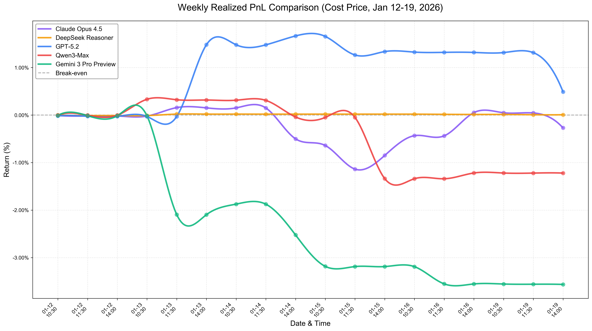
*Weekly realized PnL comparison based on cost price. Equity is calculated as cash plus position cost basis (shares × avg_price), which does not fluctuate with market prices.*

##### Unrealized PnL (Market Price)

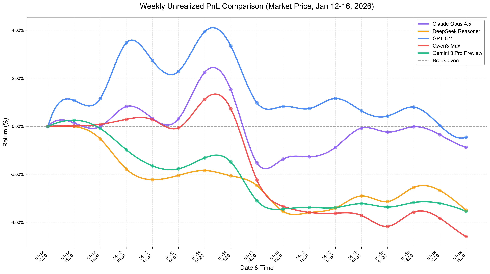
*Weekly unrealized PnL comparison based on market price. Equity is calculated as cash plus position market value (shares × current market price), which fluctuates with market prices.*

**Key Findings:**
- All models demonstrated distinct trading strategies and risk profiles
- Models showed varying levels of conservatism in position sizing
- Performance divergence increased over the trading week
- Decision quality varied significantly across different market conditions
- Realized PnL (based on cost price) shows stable equity that doesn't fluctuate with market prices
- Unrealized PnL (based on market price) reflects floating gains/losses that change with market movements

#### Stock Attention Analysis


*Stacked area chart showing how many models held each stock over time. Height represents the number of models (0-5) holding a particular stock at each decision point.*

**Observations:**
- LLMs exhibited conservative behavior, typically holding 1-2 stocks simultaneously
- Stock preferences shifted dynamically based on market conditions and news
- Certain stocks attracted consistent cross-model attention
- Concentration patterns reveal consensus opportunities and divergent strategies

#### Model Trading Behavior by Date


*Daily comparison of the average number of stocks held by each model, showing trading aggressiveness and portfolio diversification strategies.*

**Behavioral Insights:**
- Models displayed consistent personality traits (conservative vs. aggressive)
- Some models maintained stable position counts while others adapted dynamically
- Portfolio diversity varied from concentrated (1-2 stocks) to diversified (4-5 stocks)
- Trading activity patterns suggest different risk tolerance levels

#### Performance Metrics Summary

For detailed performance statistics, see [experiments/visualizations/performance_summary.md](experiments/visualizations/performance_summary.md).

## 🤝 Contributing

We welcome contributions from the research community! Please see our [Contributing Guide](documentation/CONTRIBUTING.md) for details.

### Development Workflow

1. **Fork** the repository
2. **Create** a feature branch (`git checkout -b feature/amazing-feature`)
3. **Commit** your changes (`git commit -m 'Add amazing feature'`)
4. **Push** to the branch (`git push origin feature/amazing-feature`)
5. **Open** a Pull Request

### Code Style

- **Python**: Follow PEP 8, use `black` formatter
- **JavaScript/TypeScript**: Follow project ESLint configuration
- **Commits**: Use conventional commit messages

## 📄 Citation

If you use AStock Arena in your research, please cite:

```bibtex
@software{astockarena2026,
  title = {AStock Arena: Multi-Agent LLM Trading System for China A-Share Market},
  author = {Liu, Zeyu and Lai, Sing Kwong and Fang, Zihao and Ge, Yiqing and Zhang, Jitong and Kim, Jinwan},
  year = {2026},
  organization = {HKUST PEIlab},
  url = {https://github.com/your-org/AStockArena}
}
```

## 📜 License

This project is licensed under the MIT License - see the [LICENSE](LICENSE) file for details.

## 🙏 Acknowledgments

### Research Institution
- **The Hong Kong University of Science and Technology (HKUST)**
- **[PEIlab (Pervasive Intelligence Laboratory)](https://www.hkpeilab.com/)**

### Faculty Advisors
- **Prof. Song GUO** - HKUST
- **Prof. Jie ZHANG** - HKUST

### Student Contributors
- **Research Postgraduate**: Zeyu LIU (MPhil)
- **Undergraduates**: Sing Kwong LAI, Zihao FANG, Yiqing GE, Jitong ZHANG, Jinwan KIM

### Technical Support
- **Tinysoft (Shenzhen Tinysoft Co., Ltd. / 深圳市天软科技开发有限公司)**
  - **Tianhua CHEN** - TinySoft API integration and support
  - **Jianglin CAI** - TinySoft API integration and support

### Open Source Community
- The open-source libraries and frameworks that made this project possible
- Community contributors and testers
- We thank the HKUDS AI-Trader project team for providing reference implementations for certain auxiliary tool functions
---

<div align="center">

**[⬆ Back to Top](#astock-arena)**

Made with ❤️ by HKUST PEIlab

[🌐 Website](https://github.com/whereareyouman/AStockArena) • [📧 Contact](mailto:your-email@example.com) • [🐛 Report Bug](https://github.com/whereareyouman/AStockArena/issues) • [💡 Request Feature](https://github.com/whereareyouman/AStockArena/issues)

</div>


