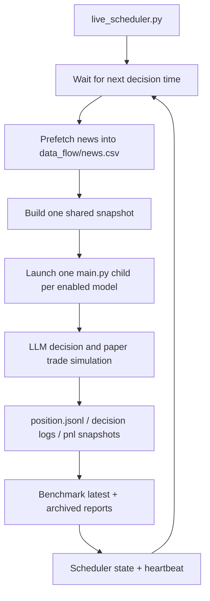

# Live Scheduler

`utilities/live_scheduler.py` is the long-running server entrypoint for live
benchmark operation. It waits for each configured decision window, prepares the
latest data, launches one isolated `main.py` process per enabled model, and then
waits for the next window.

## Start

```bash
python -m utilities.live_scheduler settings/default_config.json
```

Useful checks:

```bash
python -m utilities.live_scheduler settings/default_config.json --doctor
python -m utilities.live_scheduler settings/default_config.json --once --dry-run
python -m utilities.live_scheduler settings/default_config.json --dry-run --run-now "2026-06-18 10:30:00"
python -m utilities.live_scheduler settings/default_config.json --force-event "2026-06-18 10:30:00"
```

## Runtime Flow



## Config

Relevant `settings/default_config.json` keys:

- `run_config.live_decision_times`: default `10:30:00`, `11:30:00`, `14:00:00`
- `run_config.live_scheduler_poll_seconds`: how often the scheduler wakes while waiting
- `run_config.live_scheduler_catchup_minutes`: late-start grace window
- `run_config.live_scheduler_model_timeout_seconds`: max seconds for each decision run
- `run_config.live_scheduler_model_parallelism`: max model child processes to run concurrently
- `run_config.live_scheduler_model_start_delay_seconds`: optional per-model launch delay; falls back to `parallel_spawn_delay_seconds`
- `run_config.live_retry_attempts`: at least 3 attempts for news, snapshot, model, and benchmark stages
- `run_config.live_retry_backoff_seconds`: default retry backoff `[5, 30, 120]`
- `run_config.live_error_dir`: where error CSV/JSONL artifacts are written
- `run_config.live_snapshot_before_models`: build the shared snapshot before launching model workers
- `run_config.live_prefetch_news_before_decision`: prefetch news just before each window
- `run_config.live_abort_on_news_prefetch_failure`: whether failed news prefetch should block the run
- `run_config.live_abort_on_snapshot_failure`: whether missing price/indicator snapshot blocks the run
- `run_config.live_backtest_mode`: default `false`; live scheduler children can use live tools when snapshot/cache is missing

## Logs

- Scheduler state: `jobs/live_scheduler/state.json`
- Scheduler heartbeat: `jobs/live_scheduler/heartbeat.json`
- Per-decision model logs: `jobs/live_scheduler/YYYY-MM-DD/*model*.log`
- Daily readable summary: `jobs/live_scheduler/YYYY-MM-DD/daily_summary.md`
- Error CSV/JSONL: `jobs/live_scheduler/errors/YYYY-MM-DD/HH-MM-SS/`
- Per-model runtime env files: `settings/runtime/live_scheduler/`
- Benchmark latest outputs: `data_flow/benchmark_reports/latest.md`, `.json`, `.csv`

Only one scheduler instance can run at a time. A second instance exits with a
message instead of launching duplicate model jobs.

Error directories contain:

- `error_summary.csv`: human-readable rows with date, decision time, stage, model, symbol, error, and Chinese `human_message`
- `error_details.jsonl`: complete machine-readable records
- `traceback_*.txt`: full traceback when available
- `stdout_tail_*.txt` / `stderr_tail_*.txt`: child-process output tails when available
